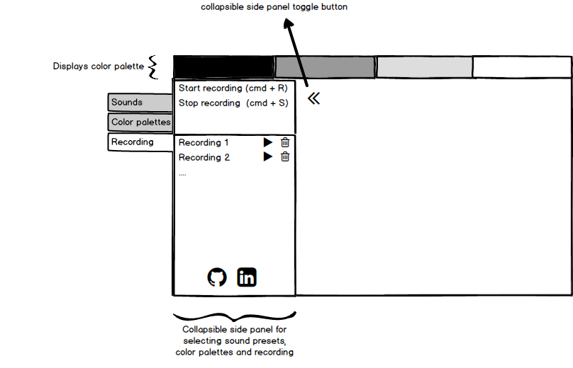

# Fluid Sounds

[howler]: https://github.com/goldfire/howler.js/
[lf]: https://github.com/google/liquidfun

## Overview

Fluid Sounds is a dynamic music app that maps the keys of the keyboard to different sounds and positions at the baseline of the application screen, every hit on a key triggers a wave on the screen. Waves can interact with each other and have different colors. The colors of waves fade out with time.

## Functionality & MVP

Fluid Sounds will enable users to:

- [ ] Play music
- [ ] See visual animations of the music they're playing
- [ ] Select the preset of tones that can be played
- [ ] Adjust viscosity of the liquid medium that generates animations
- [ ] Select color palette from provided few themes

## Wireframes
This app will consist of a game screen, a top or bottom bar(dropdown) for displaying and selecting a color palette, a sidebar with options of recording songs and playing the recoded ones, and nav links to the Github, my LinkedIn.

## Architecture and Technologies

Fluid Sounds will utilize the following technologies:

  * Vanilla JavaScript and `jquery` for overall structure and key mapping
  * [howler.js][howler] for playing pre-recorded sounds
  * [LiquidFun][lf] for animations
  * Webpack to bundle scripts

tones.js: This script will have 2 classes, a `Tone` and a `tone_factory`. `Tone` object is the core object of this app. A tone will have a color, a sound and a location on the string. `ToneFactory` is a factory class that given the conditions, generates a collection of tones with correct sound, position and color(color will depend on the position).

player.js: this script will handle playing the audio tones

visualizer.js: this script will handle rendering of tones using particles from LiquidFun library.

fluid_sounds.js: the main script of the app will connect the visualizer, player and other graphical components.

## Implementation Timeline

### Day 1
* Create the skeleton and bundler
* Figure out how to work with howler and liquid fun, generate a few sample sounds
* Revise project architecture after finding out how howler and liquid fun works.

### Day 2
GOAL: have the basics of the project working
* Create visualizer component
* Map keys to visualizations and sounds

### Day 3
* Add color palettes option to `tones`
* Add sound selections to `tones`

### Day 4
* Create and style frontend elements:
  - Color palette dropdown
  - Sidebar
* Add a nice recording

## Bonus Features
- [ ] record and play tracks
- [ ] create several layers of tracks and combine them
- [ ] upload and play audio files
